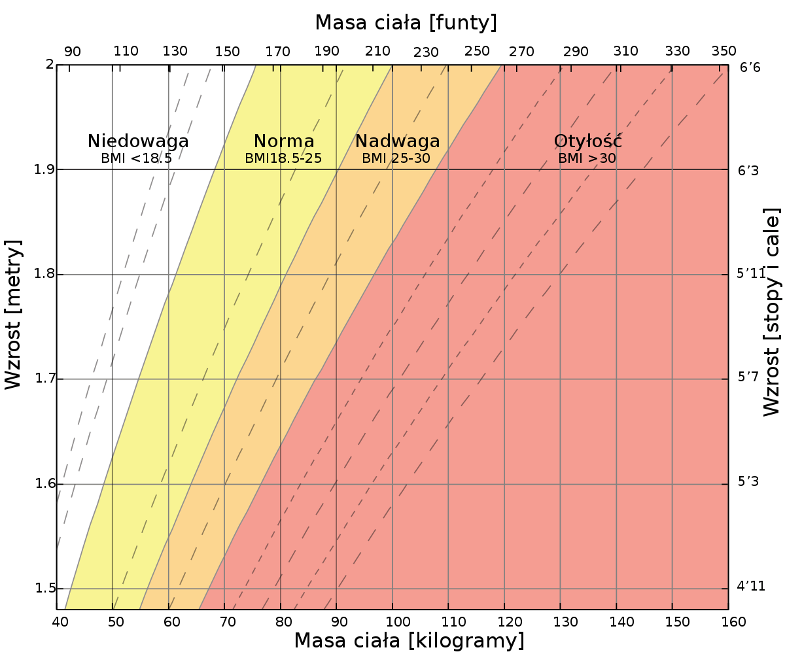

# Dane 

Zestaw danych zawiera 18 zmiennych (9 wartości logicznych, 5 ciągów znaków i 4 liczby dziesiętne). W projektach związanych z uczeniem maszynowym "HeartDisease" może być wykorzystywane jako zmienna objaśniająca, ale należy zauważyć, że klasy są silnie niezrównoważone.

Dane pobrane zostały z kaggle: <https://www.kaggle.com/code/georgyzubkov/heart-disease-exploratory-data-analysis/input>. Dane zawierają takie cechy jak:

## Opis cech:

-   **HeartDisease** - czy badany ma chorobę serca.

-   **BMI** - wartość, która pozwala ocenić stopień zgodności masy ciała osoby z jej wzrostem, a tym samym pośrednio ocenić, czy masa jest niewystarczająca, normalna czy nadmierna. Jest to ważne przy ustalaniu wskazań do konieczności leczenia.

-   **Smoking** - palenie jest głównym czynnikiem ryzyka chorób sercowo-naczyniowych. Po inhalacji dymu z papierosa reakcja układu sercowo-naczyniowego następuje natychmiastowo: w ciągu jednej minuty tempo akcji serca zaczyna wzrastać, zwiększając się o 30% w ciągu dziesięciu minut palenia. Zły nawyk również podnosi ciśnienie krwi, poziom fibrinogenu i płytek krwi, co zwiększa prawdopodobieństwo powstawania skrzepów.

-   **AlcoholDrinking** - alkohol powoduje nie tylko tymczasowe zaburzenia w funkcjonowaniu serca, ale także trwałe. Ból serca po alkoholu to nie jedyny problem zdrowotny związany z jego spożyciem.

-   **Stroke** - Udar niedokrwienny występuje 4 razy częściej niż krwotoczny. Jedną z głównych przyczyn tego cierpienia są choroby serca, które upośledzają jego funkcjonowanie, w wyniku czego przepływ krwi w tętnicach jest zakłócony, a dopływ krwi do mózgu zmniejszony. Inną przyczyną udaru w chorobach serca jest zakrzepica, gdy powstają skrzepy w jamach serca (najczęściej przy niewydolności serca) - skrzepy krwi.

-   **PhysicalHealth** - ile dni w miesiącu badany czuł się zle pod kątem zdrowia fizycznego.

-   **MentalHealth** - ile dni w miesiącu badany czuł się zle pod kątem zdrowia psychicznego.

-   **DiffWalking** - trudność w wchodzeniu po schodach.

-   **Sex** - płeć osoby.

-   **AgeCategory** - kategoria wiekowa badanych.

-   **Race** - rasa.

-   **Diabetic** - cukrzyca.

-   **PhysicalActivity** - badano, którzy zgłosili wykonywanie aktywności fizycznej lub ćwiczeń w ciągu ostatnich 30 dni oprócz swojej regularnej pracy.

-   **GenHealth** - samopoczucie.

-   **SleepTime** - liczba godzin snu.

-   **Asthma** - astma.

-   **KidneyDisease** - choroba nerek.

-   **Skin Cancer** - rak skóry.

## Instalacja i wszystywanie potrzebnych bibliotek w środowisku R

```{r echo=FALSE, results='asis'}
#install.packages("readxl")
library(readxl)
#install.packages("Rgraphviz")
library(Rgraphviz)
#install.packages("bnlearn")
library(bnlearn)
#install.packages("gRain")
library(gRain)
library(lattice)
```

## Wczytywanie danych z csv

```{r echo=FALSE, results='asis'}
#cardio <- read.csv("C:\\Users\\Aldona\\Documents\\GitHub\\Heart-Disease-data-analysis\\heart_2020_cleaned.csv")
cardio <- read.csv("heart_2020_cleaned.csv")
knitr::kable(head(cardio[,c(1:7)]), "pipe", align = "ccccc")
knitr::kable(head(cardio[,c(7:15)]), "pipe", align = "ccccc")
```

## Redukcja ilości danych atrybutowych do (5-7)

```{r pressure, echo=FALSE, out.width = '100%'}
knitr::include_graphics("ktore.png")
```

Pod uwage wzięłam tylko te cechy, które mają zazwyczaj największy wpły na występowanie chorób kardiologicznych.

```{r}
# usuwam SkinCancer
cardio <- cardio[, -18]
# usuwam KidneyDisease
cardio <- cardio[, -17]
#usuwam Asthma
cardio <- cardio[, -16]
#usuwam SleepTime
cardio <- cardio[, -15]
#usuwam GenHealth
cardio <- cardio[, -14]
#usuwam Race
cardio <- cardio[, -11]
#usuwam Sex
cardio <- cardio[, -9]
#usuwam DiffWalking
cardio <- cardio[, -8]
#usuwam MentalHealth
cardio <- cardio[, -7]
#usuwam PhisicalHealth
cardio <- cardio[, -6]
knitr::kable(head(cardio), "pipe", align = "ccccc")
```
## Usuwanie wartości odstających
Wartości odstające usuwam w kolumnie BMI, reszta kolumn nie ma wartości znacząco odstających.
```{r}
min_BMI <- min(cardio$BMI)
# 12.02
cardio <- cardio[!cardio$BMI == min_BMI,]
min_BMI <- min(cardio$BMI)
#####################################################
max_BMI <- max(cardio$BMI)
# 94.85
cardio <- cardio[!cardio$BMI == max_BMI,]
max_BMI <- max(cardio$BMI)

```

## Grupowanie danych
Wiek osób badanych poddany został grupowaniu na etapie zbierania danych, więc nie wymagał dodatkowego grupowania. Grupowaniu poddany został wskaźniek BMI, zgodnie z poniższym rysunkiem.

```{r , echo=FALSE, out.width = '100%'}

```

```{r, echo=TRUE}
min_BMI <- min(cardio$BMI)
max_BMI <- max(cardio$BMI)

BMI_groups <- cut(cardio$BMI,
                  breaks = c(min_BMI, 18.5, 25, 30, max_BMI),
                  labels = c("Niedowaga", "Norma", "Nadwaga", "Otyłość"),
                  #konieczne jest dodanie include lowest = T, gdyz bez tego wyrzuca wartości z granicy przedziału :(
                  include.lowest = TRUE
)

#usuwanie nieuzywanych poziomów
#BMI_groups <- droplevels(BMI_groups)
#BMI_groups <- as.factor(BMI_groups)
#cardio$BMI <- as.factor(cardio$BMI)
#cardio$BMI <- BMI_groups
#> anyNA(cardio)
#[1] TRUE


head(BMI_groups)
```
## Zmiana danych na czynniki
Aby możnabyło działac na danych zmieniamy ich typ na wektor.

Może trzeba będzie zmniejszyć liczbę przedziałów wieku?

```{r}
cardio$HeartDisease <- as.factor(cardio$HeartDisease)
cardio$BMI <- as.factor(BMI_groups)
cardio$Smoking <- as.factor(cardio$Smoking)
cardio$AlcoholDrinking <- as.factor(cardio$AlcoholDrinking)
cardio$Stroke <- as.factor(cardio$Stroke)
cardio$AgeCategory <- as.factor(cardio$AgeCategory)
cardio$Diabetic <- as.factor(cardio$Diabetic)
cardio$PhysicalActivity <- as.factor(cardio$PhysicalActivity)
str(cardio)
```

## Usuwanie nieużywanych poziomów
```{r}
#opcjonalne
cardio$HeartDisease <- droplevels(cardio$HeartDisease)
cardio$BMI <- droplevels(cardio$BMI)
cardio$Smoking <- droplevels(cardio$Smoking)
cardio$AlcoholDrinking <- droplevels(cardio$AlcoholDrinking)
cardio$Stroke <- droplevels(cardio$Stroke)
cardio$AgeCategory <- droplevels(cardio$AgeCategory)
cardio$Diabetic <- droplevels(cardio$Diabetic)
cardio$PhysicalActivity <- droplevels(cardio$PhysicalActivity)
```
## Dane po przerobieniu

```{r}
head(cardio)
```

```{r}
#library(bnlearn)
#if (!requireNamespace("BiocManager", quietly = TRUE))
#  install.packages("BiocManager")
#BiocManager::install(c("graph", "RBGL", "Rgraphviz"))
#a
#install.packages("gRain", dependencies=TRUE)
```

# Badanie niezależności
Badam niezależność wszystkich węzłów dzięki funkcji ci.test. Każda z tych komend testuje dwie zmienne, a wszystkie kombinacje zmiennych są uwzględnione. Zaznaczyłam, które z nich mają p-value mniejsze niż 0.05.
Wszystkie zmienne wyszły niezależne, czy to ok?
```{r}
ci.test("HeartDisease", "BMI", test = "x2", data = cardio)
ci.test("HeartDisease", "Smoking", test = "x2", data = cardio)
ci.test("HeartDisease", "AlcoholDrinking", test = "x2", data = cardio)
ci.test("HeartDisease", "Stroke", test = "x2", data = cardio)
ci.test("HeartDisease", "AgeCategory", test = "x2", data = cardio)
ci.test("HeartDisease", "Diabetic", test = "x2", data = cardio)
ci.test("HeartDisease", "PhysicalActivity", test = "x2", data = cardio)
ci.test("BMI", "Smoking", test = "x2", data = cardio)
ci.test("BMI", "AlcoholDrinking", test = "x2", data = cardio)
ci.test("BMI", "Stroke", test = "x2", data = cardio)
ci.test("BMI", "AgeCategory", test = "x2", data = cardio)
ci.test("BMI", "Diabetic", test = "x2", data = cardio)
ci.test("BMI", "PhysicalActivity", test = "x2", data = cardio)
ci.test("Smoking", "AlcoholDrinking", test = "x2", data = cardio)
ci.test("Smoking", "Stroke", test = "x2", data = cardio)
ci.test("Smoking", "AgeCategory", test = "x2", data = cardio)
ci.test("Smoking", "Diabetic", test = "x2", data = cardio)
ci.test("Smoking", "PhysicalActivity", test = "x2", data = cardio)
ci.test("AlcoholDrinking", "Stroke", test = "x2", data = cardio)
ci.test("AlcoholDrinking", "AgeCategory", test = "x2", data = cardio)
ci.test("AlcoholDrinking", "Diabetic", test = "x2", data = cardio)
ci.test("AlcoholDrinking", "PhysicalActivity", test = "x2", data = cardio)
ci.test("Stroke", "AgeCategory", test = "x2", data = cardio)
ci.test("Stroke", "Diabetic", test = "x2", data = cardio)
ci.test("Stroke", "PhysicalActivity", test = "x2", data = cardio)
ci.test("AgeCategory", "Diabetic", test = "x2", data = cardio)
ci.test("AgeCategory", "PhysicalActivity", test = "x2", data = cardio)
ci.test("Diabetic", "PhysicalActivity", test = "x2", data = cardio)


```
# Sieci
Jeśli graf jest grafem nieskierowanym, to przekształcam go na skierowany lub usuwamy krawędzie.

## Sieć HC
```{r}
siec_hc <- hc(cardio)
graphviz.plot(siec_hc)
```

## Sieć TABU
```{r}
siec_tabu <- tabu(cardio)
graphviz.plot(siec_tabu)
```

## Sieć IAMB

```{r}
siec_iamb_delete <- iamb(cardio)

directed(siec_iamb_delete)
siec_iamb_delete <- drop.arc(siec_iamb_delete, from = "HeartDisease", to = "BMI")
siec_iamb_delete <- drop.arc(siec_iamb_delete, from = "HeartDisease", to = "Stroke")
siec_iamb_delete <- drop.arc(siec_iamb_delete, from = "HeartDisease", to = "PhysicalActivity")
siec_iamb_delete <- drop.arc(siec_iamb_delete, from = "BMI", to = "PhysicalActivity")
siec_iamb_delete <- drop.arc(siec_iamb_delete, from = "Stroke", to = "PhysicalActivity")
siec_iamb_delete <- drop.arc(siec_iamb_delete, from = "Smoking", to = "AgeCategory")
siec_iamb_delete <- drop.arc(siec_iamb_delete, from = "AgeCategory", to = "Diabetic")
graphviz.plot(siec_iamb_delete)
score(siec_iamb_delete, data = cardio, type = 'bic')
```
```{r}
siec_iamb <- iamb(cardio)

directed(siec_iamb)
siec_iamb <- set.arc(siec_iamb, from = "HeartDisease", to = "BMI")
siec_iamb <- set.arc(siec_iamb, from = "HeartDisease", to = "Stroke")
siec_iamb <- set.arc(siec_iamb, from = "HeartDisease", to = "PhysicalActivity")
siec_iamb <- set.arc(siec_iamb, from = "BMI", to = "PhysicalActivity")
siec_iamb <- set.arc(siec_iamb, from = "Stroke", to = "PhysicalActivity")
siec_iamb <- set.arc(siec_iamb, from = "Smoking", to = "AgeCategory")
siec_iamb <- set.arc(siec_iamb, from = "AgeCategory", to = "Diabetic")
graphviz.plot(siec_iamb)
score(siec_iamb, data = cardio, type = 'bic')
```

```{r}
#library(igraph)
#test_iamb <- as.igraph(siec_iamb)
#is_directed(test_iamb)
#graphviz.plot(test_iamb)
```


## Sieć FAST.IAMB

```{r}
siec_fast_iamb_delete <- fast.iamb(cardio)
siec_fast_iamb_delete <- drop.arc(siec_fast_iamb_delete, from = "HeartDisease", to = "BMI")
siec_fast_iamb_delete <- drop.arc(siec_fast_iamb_delete, from = "HeartDisease", to = "Stroke")
siec_fast_iamb_delete <- drop.arc(siec_fast_iamb_delete, from = "HeartDisease", to = "PhysicalActivity")
siec_fast_iamb_delete <- drop.arc(siec_fast_iamb_delete, from = "BMI", to = "PhysicalActivity")
siec_fast_iamb_delete <- drop.arc(siec_fast_iamb_delete, from = "Stroke", to = "PhysicalActivity")
siec_fast_iamb_delete <- drop.arc(siec_fast_iamb_delete, from = "Smoking", to = "AgeCategory")
siec_fast_iamb_delete <- drop.arc(siec_fast_iamb_delete, from = "AgeCategory", to = "Diabetic")
graphviz.plot(siec_fast_iamb_delete)
```
```{r}
siec_fast_iamb <- fast.iamb(cardio)
siec_fast_iamb <- set.arc(siec_fast_iamb, from = "HeartDisease", to = "BMI")
siec_fast_iamb <- set.arc(siec_fast_iamb, from = "HeartDisease", to = "Stroke")
siec_fast_iamb <- set.arc(siec_fast_iamb, from = "HeartDisease", to = "PhysicalActivity")
siec_fast_iamb <- set.arc(siec_fast_iamb, from = "BMI", to = "PhysicalActivity")
siec_fast_iamb <- set.arc(siec_fast_iamb, from = "Stroke", to = "PhysicalActivity")
siec_fast_iamb <- set.arc(siec_fast_iamb, from = "Smoking", to = "AgeCategory")
siec_fast_iamb <- set.arc(siec_fast_iamb, from = "AgeCategory", to = "Diabetic")
graphviz.plot(siec_fast_iamb)
```

Używając metody IAMB lub FAST.IAMB, jeżeli w grafie mamy krawędzie nieskierowane, lepsze rezultaty daje nadanie krawędziom kierunku, niż ich usuwanie.
```{r}
score(siec_iamb_delete, data = cardio, type = 'bic')
score(siec_iamb, data = cardio, type = 'bic')
score(siec_fast_iamb_delete, data = cardio, type = 'bic')
score(siec_fast_iamb, data = cardio, type = 'bic')
siec_iamb_better <- siec_iamb
siec_fast_iamb_better <- siec_fast_iamb
```


## Sieć PC.STABLE

```{r}
siec_pc_stable <- pc.stable(cardio)
siec_pc_stable <- set.arc(siec_pc_stable, from = "AgeCategory", to = "Diabetic")
siec_pc_stable <- set.arc(siec_pc_stable, from = "HeartDisease", to = "Diabetic")
siec_pc_stable <- set.arc(siec_pc_stable, from = "HeartDisease", to = "BMI")
siec_pc_stable <- set.arc(siec_pc_stable, from = "HeartDisease", to = "AgeCategory")
siec_pc_stable <- set.arc(siec_pc_stable, from = "HeartDisease", to = "Stroke")
siec_pc_stable <- set.arc(siec_pc_stable, from = "BMI", to = "AgeCategory")
siec_pc_stable <- set.arc(siec_pc_stable, from = "BMI", to = "Diabetic")
siec_pc_stable <- set.arc(siec_pc_stable, from = "Stroke", to = "AgeCategory")
siec_pc_stable <- set.arc(siec_pc_stable, from = "Stroke", to = "Diabetic")
siec_pc_stable <- set.arc(siec_pc_stable, from = "AlcoholDrinking", to = "AgeCategory")
siec_pc_stable <- set.arc(siec_pc_stable, from = "AlcoholDrinking", to = "Diabetic")
graphviz.plot(siec_pc_stable)
```
```{r}
siec_pc_stable_delete <- pc.stable(cardio)
siec_pc_stable_delete <- drop.arc(siec_pc_stable_delete, from = "AgeCategory", to = "Diabetic")
siec_pc_stable_delete <- drop.arc(siec_pc_stable_delete, from = "HeartDisease", to = "Diabetic")
siec_pc_stable_delete <- drop.arc(siec_pc_stable_delete, from = "HeartDisease", to = "BMI")
siec_pc_stable_delete <- drop.arc(siec_pc_stable_delete, from = "HeartDisease", to = "AgeCategory")
siec_pc_stable_delete <- drop.arc(siec_pc_stable_delete, from = "HeartDisease", to = "Stroke")
siec_pc_stable_delete <- drop.arc(siec_pc_stable_delete, from = "BMI", to = "AgeCategory")
siec_pc_stable_delete <- drop.arc(siec_pc_stable_delete, from = "BMI", to = "Diabetic")
siec_pc_stable_delete <- drop.arc(siec_pc_stable_delete, from = "Stroke", to = "AgeCategory")
siec_pc_stable_delete <- drop.arc(siec_pc_stable_delete, from = "Stroke", to = "Diabetic")
siec_pc_stable_delete <- drop.arc(siec_pc_stable_delete, from = "AlcoholDrinking", to = "AgeCategory")
siec_pc_stable_delete <- drop.arc(siec_pc_stable_delete, from = "AlcoholDrinking", to = "Diabetic")
graphviz.plot(siec_pc_stable_delete)
```

Używając metody PC.STABLE, jeżeli w grafie mamy krawędzie nieskierowane, lepsze rezultaty daje usunięcie krawędzi , niż nadanie im kierunku.
```{r}
score(siec_pc_stable_delete, data = cardio, type = 'bic')
score(siec_pc_stable, data = cardio, type = 'bic')
siec_pc_stable_better <- siec_pc_stable_delete
```

## Sieć GS

```{r}
siec_gs <- gs(cardio)
siec_gs <- set.arc(siec_gs, from = "AgeCategory", to = "Diabetic")
siec_gs <- set.arc(siec_gs, from = "BMI", to = "PhysicalActivity")
siec_gs <- set.arc(siec_gs, from = "Smoking", to = "AgeCategory")
siec_gs <- set.arc(siec_gs, from = "HeartDisease", to = "Stroke")
graphviz.plot(siec_gs)
```
```{r}
siec_gs_delete <- gs(cardio)
siec_gs_delete <- drop.arc(siec_gs_delete, from = "AgeCategory", to = "Diabetic")
siec_gs_delete <- drop.arc(siec_gs_delete, from = "BMI", to = "PhysicalActivity")
siec_gs_delete <- drop.arc(siec_gs_delete, from = "Smoking", to = "AgeCategory")
siec_gs_delete <- drop.arc(siec_gs_delete, from = "HeartDisease", to = "Stroke")
graphviz.plot(siec_gs_delete)
```

Używając metody GS, jeżeli w grafie mamy krawędzie nieskierowane, lepsze rezultaty daje nadanie krawędziom kierunku, niż ich usuwanie.
```{r}
score(siec_gs_delete, data = cardio, type = 'bic')
score(siec_gs, data = cardio, type = 'bic')
siec_gs_better <- siec_gs
```
## Wybór sieci
Najwyższy wynik to najlepszy graf. 
```{r}
score(siec_hc, data = cardio, type = 'bic')
score(siec_tabu, data = cardio, type = 'bic')
score(siec_iamb_better, data = cardio, type = 'bic')
#the graph is only partially directed
score(siec_fast_iamb_better, data = cardio, type = 'bic')
#the graph is only partially directed
score(siec_pc_stable_better, data = cardio, type = 'bic')
#the graph is only partially directed
score(siec_gs_better, data = cardio, type = 'bic')
# the graph is only partially directed
model <- siec_tabu
```
Najlepszym modelem do wyboru jest model TABU.

# Rozkład prawdopodobieństw

## Rozkład osób palących pod warunkiem występowania chorób kardiologicznych

```{r}
# Smoking
p_smoke <- sum(cardio$Smoking == "Yes") / nrow(cardio)
p_no_smoke <- sum(cardio$Smoking == "No") / nrow(cardio)

# Heart Disease
p_healthy <- sum(cardio$HeartDisease == "No") / nrow(cardio)
p_sick <- sum(cardio$HeartDisease == "Yes") / nrow(cardio)

# Prawdopodobieństwo że pacjent pali pod warunkiem że jest zdrowy
p_smoke_given_healthy <- sum(cardio$Smoking == "Yes" & cardio$HeartDisease == "No") / sum(cardio$HeartDisease == "No")

# Prawdopodobieństwo że pacjent pali pod warunkiem że jest chory
p_smoke_given_sick <- sum(cardio$Smoking == "Yes" & cardio$HeartDisease == "Yes") / sum(cardio$HeartDisease == "Yes")

# Prawdopodobieństwo że pacjent nie pali pod warunkiem że jest zdrowy
p_no_smoke_given_healthy <- sum(cardio$Smoking == "No" & cardio$HeartDisease == "No") / sum(cardio$HeartDisease == "No")

# Prawdopodobieństwo że pacjent nie pali pod warunkiem że jest chory
p_no_smoke_given_sick <- sum(cardio$Smoking == "No" & cardio$HeartDisease == "Yes") / sum(cardio$HeartDisease == "Yes")


Warunek = c(rep("bez warunku",2), rep("Yes", 2), rep("No",2))
Pali = rep(c("Yes", "No"), 3) #Smoking
dane <- data.frame(Warunek = Warunek, Test = Pali,
                   Prawdopodobienstwo = c(
                     #p_no_smoke_given_healthy*p_healthy+p_no_smoke_given_sick*p_sick, 
                     #1-(p_no_smoke_given_healthy*p_healthy+p_no_smoke_given_sick*p_sick),
                     p_smoke,p_no_smoke,
                     p_no_smoke_given_healthy, p_smoke_given_healthy, p_no_smoke_given_sick, p_smoke_given_sick))
barchart(Test ~ Prawdopodobienstwo | Warunek, data = dane,
         scales = list(alternating = 1, tck = c(1, 0)),
         strip = strip.custom(factor.levels =
                                c(expression(Pr(Pali)),
                                  expression(Pr({Pali} * " | " * {Chory == NIE})),
                                  expression(Pr({Pali} * " | " * {Choroba == TAK})))),
)

```

## Rozkład BMI pod warunkiem występowania chorób kardiologicznych

```{r}
# Heart Disease
p_healthy <- sum(cardio$HeartDisease == "No") / nrow(cardio)
p_sick <- sum(cardio$HeartDisease == "Yes") / nrow(cardio)

# Parametry BMI
p_niedowaga <- sum(cardio$BMI == "Niedowaga") / nrow(cardio)
p_norma <- sum(cardio$BMI == "Norma") / nrow(cardio)
p_nadwaga <- sum(cardio$BMI == "Nadwaga") / nrow(cardio)
p_otylosc <- sum(cardio$BMI == "Otyłość") / nrow(cardio)

# Prawdopodobieństwo że pacjent ma odpowiednie BMI pod warunkiem że jest zdrowy
p_bmi_given_healthy <- c(
  sum(cardio$BMI == "Niedowaga" & cardio$HeartDisease == "No") / sum(cardio$HeartDisease == "No"),
  sum(cardio$BMI == "Norma" & cardio$HeartDisease == "No") / sum(cardio$HeartDisease == "No"),
  sum(cardio$BMI == "Nadwaga" & cardio$HeartDisease == "No") / sum(cardio$HeartDisease == "No"),
  sum(cardio$BMI == "Otyłość" & cardio$HeartDisease == "No") / sum(cardio$HeartDisease == "No")
)

# Prawdopodobieństwo że pacjent ma odpowiednie BMI pod warunkiem że jest chory
p_bmi_given_sick <- c(
  sum(cardio$BMI == "Niedowaga" & cardio$HeartDisease == "Yes") / sum(cardio$HeartDisease == "Yes"),
  sum(cardio$BMI == "Norma" & cardio$HeartDisease == "Yes") / sum(cardio$HeartDisease == "Yes"),
  sum(cardio$BMI == "Nadwaga" & cardio$HeartDisease == "Yes") / sum(cardio$HeartDisease == "Yes"),
  sum(cardio$BMI == "Otyłość" & cardio$HeartDisease == "Yes") / sum(cardio$HeartDisease == "Yes")
)

Warunek <- c(rep("bez warunku",4), rep("Yes", 4), rep("No",4))
BMI <- rep(c("Niedowaga", "Norma", "Nadwaga", "Otyłość"), 3)
dane <- data.frame(Warunek = Warunek, BMI = BMI,
                   Prawdopodobienstwo = c(
                    p_niedowaga, p_norma, p_nadwaga, p_niedowaga,
                    p_bmi_given_healthy[1],p_bmi_given_healthy[2],
                    p_bmi_given_healthy[3],p_bmi_given_healthy[4],
                    p_bmi_given_sick[1],p_bmi_given_sick[2],
                    p_bmi_given_sick[3],p_bmi_given_sick[4]
                    
                   ))
barchart(BMI ~ Prawdopodobienstwo | Warunek, data = dane,
         scales = list(alternating = 1, tck = c(1, 0)),
         strip = strip.custom(factor.levels =
                                c(expression(Pr(BMI)),
                                  expression(Pr({BMI} * " | " * {Chory == NIE})),
                                  expression(Pr({BMI} * " | " * {Chory == TAK})))),
)

```

## Rozkład osób palących pod warunkiem występowania chorób kardiologicznych

```{r}
# Alcohol Drinking
p_drink <- sum(cardio$AlcoholDrinking == "Yes") / nrow(cardio)
p_no_drink <- sum(cardio$AlcoholDrinking == "No") / nrow(cardio)

# Heart Disease
p_healthy <- sum(cardio$HeartDisease == "No") / nrow(cardio)
p_sick <- sum(cardio$HeartDisease == "Yes") / nrow(cardio)

# Prawdopodobieństwo że pacjent pije alkohol pod warunkiem że jest zdrowy
p_drink_given_healthy <- sum(cardio$AlcoholDrinking == "Yes" & cardio$HeartDisease == "No") / sum(cardio$HeartDisease == "No")

# Prawdopodobieństwo że pacjent pije alkohol pod warunkiem że jest chory
p_drink_given_sick <- sum(cardio$AlcoholDrinking == "Yes" & cardio$HeartDisease == "Yes") / sum(cardio$HeartDisease == "Yes")

# Prawdopodobieństwo że pacjent nie pije alkoholu pod warunkiem że jest zdrowy
p_no_drink_given_healthy <- sum(cardio$AlcoholDrinking == "No" & cardio$HeartDisease == "No") / sum(cardio$HeartDisease == "No")

# Prawdopodobieństwo że pacjent nie pije alkoholu pod warunkiem że jest chory
p_no_drink_given_sick <- sum(cardio$AlcoholDrinking == "No" & cardio$HeartDisease == "Yes") / sum(cardio$HeartDisease == "Yes")


Warunek <- c(rep("bez warunku", 2), rep("Yes", 2), rep("No", 2))
Pije <- rep(c("Yes", "No"), 3) # Alcohol Drinking

dane <- data.frame(Warunek = Warunek, Test = Pije,
                   Prawdopodobienstwo = c(
                     p_drink, p_no_drink,
                     p_drink_given_healthy, p_no_drink_given_healthy,
                     p_drink_given_sick, p_no_drink_given_sick))

barchart(Test ~ Prawdopodobienstwo | Warunek, data = dane,
         scales = list(alternating = 1, tck = c(1, 0)),
         strip = strip.custom(factor.levels =
                                c(expression(Pr(Pije)),
                                  expression(Pr({Pije} * " | " * {Chory == NIE})),
                                  expression(Pr({Pije} * " | " * {Choroba == TAK})))),
)


```

## Rozkład osób z udarem pod warunkiem występowania chorób kardiologicznych

```{r}
# Stroke
p_stroke <- sum(cardio$Stroke == "Yes") / nrow(cardio)
p_no_stroke <- sum(cardio$Stroke == "No") / nrow(cardio)

# Heart Disease
p_healthy <- sum(cardio$HeartDisease == "No") / nrow(cardio)
p_sick <- sum(cardio$HeartDisease == "Yes") / nrow(cardio)

# Prawdopodobieństwo że pacjent miał udar pod warunkiem że jest zdrowy
p_stroke_given_healthy <- sum(cardio$Stroke == "Yes" & cardio$HeartDisease == "No") / sum(cardio$HeartDisease == "No")

# Prawdopodobieństwo że pacjent miał udar pod warunkiem że jest chory
p_stroke_given_sick <- sum(cardio$Stroke == "Yes" & cardio$HeartDisease == "Yes") / sum(cardio$HeartDisease == "Yes")

# Prawdopodobieństwo że pacjent nie miał udaru pod warunkiem że jest zdrowy
p_no_stroke_given_healthy <- sum(cardio$Stroke == "No" & cardio$HeartDisease == "No") / sum(cardio$HeartDisease == "No")

# Prawdopodobieństwo że pacjent miał udar pod warunkiem że jest zdrowy
p_no_stroke_given_sick <- sum(cardio$Stroke == "No" & cardio$HeartDisease == "Yes") / sum(cardio$HeartDisease == "Yes")


Warunek <- c(rep("bez warunku", 2), rep("Yes", 2), rep("No", 2))
Udar <- rep(c("Yes", "No"), 3) # Stroke

dane <- data.frame(Warunek = Warunek, Test = Udar,
                   Prawdopodobienstwo = c(
                     p_stroke, p_no_stroke,
                     p_stroke_given_healthy, p_no_stroke_given_healthy,
                     p_stroke_given_sick, p_no_stroke_given_sick))

barchart(Test ~ Prawdopodobienstwo | Warunek, data = dane,
         scales = list(alternating = 1, tck = c(1, 0)),
         strip = strip.custom(factor.levels =
                                c(expression(Pr(Udar)),
                                  expression(Pr({Udar} * " | " * {Chory == NIE})),
                                  expression(Pr({Udar} * " | " * {Choroba == TAK})))),
)

```

## Rozkład osób z chorobami kardiologicznymi pod warunkiem występowania udaru


```{r}
# Stroke
p_stroke <- sum(cardio$Stroke == "Yes") / nrow(cardio)
p_no_stroke <- sum(cardio$Stroke == "No") / nrow(cardio)

# Heart Disease
p_healthy <- sum(cardio$HeartDisease == "Yes") / nrow(cardio)
p_sick <- sum(cardio$HeartDisease == "No") / nrow(cardio)


# Prawdopodobieństwo, że pacjent jest zdrowy lub chory pod warunkiem, że miał udar
p_sick_given_stroke <- sum(cardio$HeartDisease == "Yes" & cardio$Stroke == "Yes") / sum(cardio$Stroke == "Yes")
p_sick_given_no_stroke <- sum(cardio$HeartDisease == "Yes" & cardio$Stroke == "No") / sum(cardio$Stroke == "No")

p_healthy_given_stroke <- sum(cardio$HeartDisease == "No" & cardio$Stroke == "Yes") / sum(cardio$Stroke == "Yes")
p_healthy_given_no_stroke <- sum(cardio$HeartDisease == "No" & cardio$Stroke == "No") / sum(cardio$Stroke == "No")

Warunek <- c(rep("bez warunku", 2), rep("Yes", 2), rep("No", 2))
Choroba <- rep(c("TAK", "NIE"), 3) # Heart Disease

dane <- data.frame(Warunek = Warunek, Test = Choroba,
                   Prawdopodobienstwo = c(
                     p_healthy, p_sick,
                     p_healthy_given_no_stroke, p_sick_given_no_stroke,
                    p_healthy_given_stroke, p_sick_given_stroke))

barchart(Test ~ Prawdopodobienstwo | Warunek, data = dane,
         scales = list(alternating = 1, tck = c(1, 0)),
         strip = strip.custom(factor.levels =
                                c(expression(Pr(Choroba)),
                                  expression(Pr({Choroba} * " | " * {Udar == NIE})),
                                  expression(Pr({Choroba} * " | " * {Udar == TAK})))),
)

```

## Rozkład wieku pod warunkiem występowania chorób kardiologicznych


```{r}
# Heart Disease
p_healthy <- sum(cardio$HeartDisease == "No") / nrow(cardio)
p_sick <- sum(cardio$HeartDisease == "Yes") / nrow(cardio)

#AgeCategory

p_age <- c(
  sum(cardio$AgeCategory == "18-24") / nrow(cardio),
  sum(cardio$AgeCategory == "25-29") / nrow(cardio),
  sum(cardio$AgeCategory == "30-34") / nrow(cardio),
  sum(cardio$AgeCategory == "35-39") / nrow(cardio),
  sum(cardio$AgeCategory == "40-44") / nrow(cardio),
  sum(cardio$AgeCategory == "45-49") / nrow(cardio),
  sum(cardio$AgeCategory == "50-54") / nrow(cardio),
  sum(cardio$AgeCategory == "55-59") / nrow(cardio),
  sum(cardio$AgeCategory == "60-64") / nrow(cardio),
  sum(cardio$AgeCategory == "65-69") / nrow(cardio),
  sum(cardio$AgeCategory == "70-74") / nrow(cardio),
  sum(cardio$AgeCategory == "75-79") / nrow(cardio),
  sum(cardio$AgeCategory == "80 or older") / nrow(cardio)
)
# Prawdopodobieństwo, że pacjent jest chory pod warunkiem, że należy do określonej kategorii wiekowej
p_age_given_sick <- c(
  sum(cardio$AgeCategory == "18-24" & cardio$HeartDisease == "Yes") / sum(cardio$HeartDisease == "Yes"),
  sum(cardio$AgeCategory == "25-29" & cardio$HeartDisease == "Yes") / sum(cardio$HeartDisease == "Yes"),
  sum(cardio$AgeCategory == "30-34" & cardio$HeartDisease == "Yes") / sum(cardio$HeartDisease == "Yes"),
  sum(cardio$AgeCategory == "35-39" & cardio$HeartDisease == "Yes") / sum(cardio$HeartDisease == "Yes"),
  sum(cardio$AgeCategory == "40-44" & cardio$HeartDisease == "Yes") / sum(cardio$HeartDisease == "Yes"),
  sum(cardio$AgeCategory == "45-49" & cardio$HeartDisease == "Yes") / sum(cardio$HeartDisease == "Yes"),
  sum(cardio$AgeCategory == "50-54" & cardio$HeartDisease == "Yes") / sum(cardio$HeartDisease == "Yes"),
  sum(cardio$AgeCategory == "55-59" & cardio$HeartDisease == "Yes") / sum(cardio$HeartDisease == "Yes"),
  sum(cardio$AgeCategory == "60-64" & cardio$HeartDisease == "Yes") / sum(cardio$HeartDisease == "Yes"),
  sum(cardio$AgeCategory == "65-69" & cardio$HeartDisease == "Yes") / sum(cardio$HeartDisease == "Yes"),
  sum(cardio$AgeCategory == "70-74" & cardio$HeartDisease == "Yes") / sum(cardio$HeartDisease == "Yes"),
  sum(cardio$AgeCategory == "75-79" & cardio$HeartDisease == "Yes") / sum(cardio$HeartDisease == "Yes"),
  sum(cardio$AgeCategory == "80 or older" & cardio$HeartDisease == "Yes") / sum(cardio$HeartDisease == "Yes")
)

# Prawdopodobieństwo, że pacjent jest zdrowy pod warunkiem, że należy do określonej kategorii wiekowej
p_age_given_healthy <- c(
  sum(cardio$AgeCategory == "18-24" & cardio$HeartDisease == "No") / sum(cardio$HeartDisease == "No"),
  sum(cardio$AgeCategory == "25-29" & cardio$HeartDisease == "No") / sum(cardio$HeartDisease == "No"),
  sum(cardio$AgeCategory == "30-34" & cardio$HeartDisease == "No") / sum(cardio$HeartDisease == "No"),
  sum(cardio$AgeCategory == "35-39" & cardio$HeartDisease == "No") / sum(cardio$HeartDisease == "No"),
  sum(cardio$AgeCategory == "40-44" & cardio$HeartDisease == "No") / sum(cardio$HeartDisease == "No"),
  sum(cardio$AgeCategory == "45-49" & cardio$HeartDisease == "No") / sum(cardio$HeartDisease == "No"),
  sum(cardio$AgeCategory == "50-54" & cardio$HeartDisease == "No") / sum(cardio$HeartDisease == "No"),
  sum(cardio$AgeCategory == "55-59" & cardio$HeartDisease == "No") / sum(cardio$HeartDisease == "No"),
  sum(cardio$AgeCategory == "60-64" & cardio$HeartDisease == "No") / sum(cardio$HeartDisease == "No"),
  sum(cardio$AgeCategory == "65-69" & cardio$HeartDisease == "No") / sum(cardio$HeartDisease == "No"),
  sum(cardio$AgeCategory == "70-74" & cardio$HeartDisease == "No") / sum(cardio$HeartDisease == "No"),
  sum(cardio$AgeCategory == "75-79" & cardio$HeartDisease == "No") / sum(cardio$HeartDisease == "No"),
  sum(cardio$AgeCategory == "80 or older" & cardio$HeartDisease == "No") / sum(cardio$HeartDisease == "No")
)

Warunek <- rep(c("bez warunku", "Yes", "No"), each = 13)
Wiek <- rep(c("18-24", "25-29", "30-34", "35-39", "40-44", "45-49", "50-54", "55-59", "60-64", "65-69", "70-74", "75-79", "80 or older"), times = 3)

dane <- data.frame(Warunek = Warunek, AgeCategory = Wiek,
                   Prawdopodobienstwo = c(
                     p_age, p_age_given_healthy, p_age_given_sick
                     ))

barchart(AgeCategory ~ Prawdopodobienstwo | Warunek, data = dane,
         scales = list(alternating = 1, tck = c(1, 0)),
         strip = strip.custom(factor.levels =
                                c(expression(Pr(Wiek)),
                                  expression(Pr({Wiek} * " | " * {Chory == NIE})),
                                  expression(Pr({Wiek} * " | " * {Chory == TAK})))),
)

```
## Rozkład aktywności fizycznej pod warunkiem występowania chorób kardiologicznych

```{r}
# Phisical Activity
p_active <- sum(cardio$PhysicalActivity == "Yes") / nrow(cardio)
p_no_active <- sum(cardio$PhysicalActivity == "No") / nrow(cardio)

# Heart Disease
p_healthy <- sum(cardio$HeartDisease == "No") / nrow(cardio)
p_sick <- sum(cardio$HeartDisease == "Yes") / nrow(cardio)

# Prawdopodobieństwo że pacjent jest aktywny fizycznie pod warunkiem że jest zdrowy
p_active_given_healthy <- sum(cardio$PhysicalActivity == "Yes" & cardio$HeartDisease == "No") / sum(cardio$HeartDisease == "No")

# Prawdopodobieństwo że pacjent jest aktywny fizycznie pod warunkiem że jest chory
p_active_given_sick <- sum(cardio$PhysicalActivity == "Yes" & cardio$HeartDisease == "Yes") / sum(cardio$HeartDisease == "Yes")

# Prawdopodobieństwo że pacjent nie jest aktywny fizycznie pod warunkiem że jest zdrowy
p_no_active_given_healthy <- sum(cardio$PhysicalActivity == "No" & cardio$HeartDisease == "No") / sum(cardio$HeartDisease == "No")

# Prawdopodobieństwo że pacjent nie jest aktywny fizycznie pod warunkiem że jest chory
p_no_active_given_sick <- sum(cardio$PhysicalActivity == "No" & cardio$HeartDisease == "Yes") / sum(cardio$HeartDisease == "Yes")


Warunek = c(rep("bez warunku",2), rep("Yes", 2), rep("No",2))
Aktywnosc = rep(c("Yes", "No"), 3) #PhysicalActivity
dane <- data.frame(Warunek = Warunek, Test = Aktywnosc,
                   Prawdopodobienstwo = c(
                     #p_no_active_given_healthy*p_healthy+p_no_active_given_sick*p_sick, 
                     #1-(p_no_active_given_healthy*p_healthy+p_no_active_given_sick*p_sick),
                     p_active,p_no_active,
                     p_no_active_given_healthy, p_active_given_healthy, p_no_active_given_sick, p_active_given_sick))
barchart(Test ~ Prawdopodobienstwo | Warunek, data = dane,
         scales = list(alternating = 1, tck = c(1, 0)),
         strip = strip.custom(factor.levels =
                                c(expression(Pr(Aktywnosc)),
                                  expression(Pr({Aktywnosc} * " | " * {Chory == NIE})),
                                  expression(Pr({Aktywnosc} * " | " * {Choroba == TAK})))),
)

```

## Rozkład występowania cukrzycy pod warunkiem występowania chorób kardiologicznych

```{r}
# Diabetic
p_diabetic <- sum(cardio$Diabetic == "Yes") / nrow(cardio)
p_no_diabetic <- sum(cardio$Diabetic == "No" ) / nrow(cardio)
p_borderline_diabetic <- sum(cardio$Diabetic == "No, borderline diabetes") / nrow(cardio)

# Heart Disease
p_healthy <- sum(cardio$HeartDisease == "No") / nrow(cardio)
p_sick <- sum(cardio$HeartDisease == "Yes") / nrow(cardio)

# Prawdopodobieństwo że pacjent jest diabetykiem pod warunkiem że jest zdrowy
p_diabetic_given_healthy <- sum((cardio$Diabetic == "Yes") & cardio$HeartDisease == "No") / sum(cardio$HeartDisease == "No")

# Prawdopodobieństwo że pacjent jest diabetykiem pod warunkiem że jest chory
p_diabetic_given_sick <- sum((cardio$Diabetic == "Yes") & cardio$HeartDisease == "Yes") / sum(cardio$HeartDisease == "Yes")

# Prawdopodobieństwo że pacjent nie jest diabetykiem pod warunkiem że jest zdrowy
p_no_diabetic_given_healthy <- sum((cardio$Diabetic == "No" ) & cardio$HeartDisease == "No") / sum(cardio$HeartDisease == "No")

# Prawdopodobieństwo że pacjent nie jest diabetykiem pod warunkiem że jest chory
p_no_diabetic_given_sick <- sum((cardio$Diabetic == "No" ) & cardio$HeartDisease == "Yes") / sum(cardio$HeartDisease == "Yes")

# Prawdopodobieństwo że pacjent nie jest diabetykiem (jest na granicy) pod warunkiem że jest zdrowy
p_borderline_diabetic_given_healthy <- sum((cardio$Diabetic == "No, borderline diabetes") & cardio$HeartDisease == "No") / sum(cardio$HeartDisease == "No")

# Prawdopodobieństwo że pacjent nie jest diabetykiem (jest na granicy) pod warunkiem że jest chory
p_borderline_diabetic_given_sick <- sum((cardio$Diabetic == "No, borderline diabetes") & cardio$HeartDisease == "Yes") / sum(cardio$HeartDisease == "Yes")

Warunek <- c(rep("bez warunku",3), rep("Yes", 3), rep("No",3))
Diabetes <- rep(c("Yes", "No", "No, borderline diabetes"), 3) # Diabetic
dane <- data.frame(Warunek = Warunek, Test = Diabetes,
                   Prawdopodobienstwo = c(
                     p_diabetic, p_no_diabetic, p_borderline_diabetic,
                     p_diabetic_given_healthy, p_no_diabetic_given_healthy, p_borderline_diabetic_given_healthy,
                     p_diabetic_given_sick, p_no_diabetic_given_sick, p_borderline_diabetic_given_sick))

barchart(Test ~ Prawdopodobienstwo | Warunek, data = dane,
         scales = list(alternating = 1, tck = c(1, 0)),
         strip = strip.custom(factor.levels =
                                c(expression(Pr(Diabetes)),
                                  expression(Pr({Diabetes} * " | " * {Chory == NIE})),
                                  expression(Pr({Diabetes} * " | " * {Choroba == TAK})))),
)

```

# Zadanie 1

## Przykładowe prawdopodobieństwo

Oblicz prawdopodobieńśtwo, że losowo wybrana osoba paląca będzie miała występujące choroby kardiologiczne.


```{r}
class(model)
model <- bn.fit(model,cardio)
grain <- compile(as.grain(model))
```

```{r}
war1 <- setEvidence(grain, nodes = c("Smoking"), states = c("Yes"))
prob1 <- querygrain(war1, nodes = c("HeartDisease"))$HeartDisease
prob1

```

```{r}
war2 <- setEvidence(grain, nodes = c("Smoking"), states = c("No"))
prob2 <- querygrain(war2, nodes = c("HeartDisease"))$HeartDisease
prob2

```
## Prawdopodobieństwo "na papierze"


\[ P(Smoking = \text{Yes} | HeartDisease = \text{Yes}) = \frac{P(HeartDisease = \text{Yes} | Smoking = \text{Yes}) \times P(Smoking = \text{Yes})}{P(HeartDisease = \text{Yes})} \]

\[P(Smoking = Yes) = 
P(Smoking = Yes|AlcoholDrinking = Yes) * P(AlcoholDrinking = Yes)
+ P(Smoking = Yes|AlcoholDrinking = No) * P(AlcoholDrinking = No)\]

\[P(AlcoholDrinking = Yes) = 
P(AlcoholDrinking = Yes|Diabetic = Yes)*P(Diabetic = Yes)
+ P(AlcoholDrinking = Yes|Diabetic = No)*P(Diabetic = No)
+ P(AlcoholDrinking = Yes|Diabetic = No, borderline diabetes)*P(Diabetic = No, borderline diabetes)
\]

\[P(AlcoholDrinking = No) = 
P(AlcoholDrinking = No|Diabetic = Yes)*P(Diabetic = Yes)
+ P(AlcoholDrinking = No|Diabetic = No)*P(Diabetic = No)
+ P(AlcoholDrinking = No|Diabetic = No, borderline diabetes)*P(Diabetic = No, borderline diabetes)
\]

\[P(Diabetic = Yes) = 
P(Diabetic = Yes|HeartDisease = Yes)*P(HeartDisease = Yes)
+ P(Diabetic = Yes|HeartDisease = No)*P(HeartDisease = No)
\]

\[P(Diabetic = No) = 
P(Diabetic = No|HeartDisease = Yes)*P(HeartDisease = Yes)
+ P(Diabetic = No|HeartDisease = No)*P(HeartDisease = No)
\]

\[P(Diabetic = No, borderline diabetes) = 
P(Diabetic = No, borderline diabetes|HeartDisease = Yes)*P(HeartDisease = Yes)
+ P(Diabetic = No, borderline diabetes|HeartDisease = No)*P(HeartDisease = No)
\]

\[P(HeartDisease = Yes) = 0.08559626\]


```{r}
# p_sick_given_smoke <- sum(cardio$HeartDisease == "Yes" & cardio$Smoking == "Yes") / sum(cardio$Smoking == "Yes") 
# prawd1 = (p_sick_given_smoke*p_smoke)/p_sick
# prawd1
```


```{r}
# # P(HeartDisease = Yes)
# P_HeartDisease_Yes <- sum(cardio$HeartDisease == "Yes") / nrow(cardio)
# 
# # P(HeartDisease = No)
# P_HeartDisease_No <- sum(cardio$HeartDisease == "No") / nrow(cardio)
# 
# # P(Diabetic = Yes)
# P_Diabetic_Yes <- (sum(cardio$Diabetic == "Yes" & cardio$HeartDisease == "Yes") * P_HeartDisease_Yes +
#                    sum(cardio$Diabetic == "Yes" & cardio$HeartDisease == "No") * P_HeartDisease_No) / nrow(cardio)
# 
# # P(Diabetic = No)
# P_Diabetic_No <- (sum(cardio$Diabetic == "No" & cardio$HeartDisease == "Yes") * P_HeartDisease_Yes +
#                   sum(cardio$Diabetic == "No" & cardio$HeartDisease == "No") * P_HeartDisease_No) / nrow(cardio)
# 
# # P(Diabetic = No, borderline diabetes)
# P_Diabetic_No_borderline <- (sum(cardio$Diabetic == "No" & cardio$borderline_diabetes == "Yes" & cardio$HeartDisease == "Yes") * P_HeartDisease_Yes +
#                               sum(cardio$Diabetic == "No" & cardio$borderline_diabetes == "Yes" & cardio$HeartDisease == "No") * P_HeartDisease_No) / nrow(cardio)
# 
# # P(AlcoholDrinking = Yes)
# P_AlcoholDrinking_Yes <- (sum(cardio$AlcoholDrinking == "Yes" & cardio$Diabetic == "Yes") * P_Diabetic_Yes +
#                            sum(cardio$AlcoholDrinking == "Yes" & cardio$Diabetic == "No") * P_Diabetic_No +
#                            sum(cardio$AlcoholDrinking == "Yes" & cardio$Diabetic == "No" & cardio$borderline_diabetes == "Yes") * P_Diabetic_No_borderline) / nrow(cardio)
# 
# # P(AlcoholDrinking = No)
# P_AlcoholDrinking_No <- (sum(cardio$AlcoholDrinking == "No" & cardio$Diabetic == "Yes") * P_Diabetic_Yes +
#                           sum(cardio$AlcoholDrinking == "No" & cardio$Diabetic == "No") * P_Diabetic_No +
#                           sum(cardio$AlcoholDrinking == "No" & cardio$Diabetic == "No" & cardio$borderline_diabetes == "Yes") * P_Diabetic_No_borderline) / nrow(cardio)
# 
# # P(Smoking = Yes)
# P_Smoking_Yes <- (sum(cardio$Smoking == "Yes" & cardio$AlcoholDrinking == "Yes") * P_AlcoholDrinking_Yes +
#                   sum(cardio$Smoking == "Yes" & cardio$AlcoholDrinking == "No") * P_AlcoholDrinking_No) / nrow(cardio)
# 
# # P(Smoking = Yes | HeartDisease = Yes)
# P_Smoking_Yes_given_HeartDisease_Yes <- sum(cardio$HeartDisease == "Yes" & cardio$Smoking == "Yes") / sum(cardio$HeartDisease == "Yes")
# P_Smoking_Yes_given_HeartDisease_Yes

```


# Zadanie 2.

## Przykładowe prawdopodobieństwo

Oblicz prawdopodobieństwo, że osoba z uprawiająca aktywność fizyczną ma BMI w normie.

```{r}
war3 <- setEvidence(grain, nodes = c("PhysicalActivity"), states = c("Yes"))
prob3 <- querygrain(war3, nodes = c("BMI"))$BMI
prob3
```

## Prawdopodobieństwo "na papierze"

\[ P(BMI = \text{Norma} | \text{PhysicalActivity} = \text{Yes}) = \frac{P(\text{PhysicalActivity} = \text{Yes} | BMI = \text{Norma}) \times P(BMI = \text{Norma})}{P(\text{PhysicalActivity} = \text{Yes})} \]

```{r}
# Obliczenie prawdopodobieństwa PhysicalActivity = Yes | BMI = Norma
P_PhysicalActivity_Yes_given_BMI_Norma <- sum(cardio$PhysicalActivity == "Yes" & cardio$BMI == "Norma") / sum(cardio$BMI == "Norma")

# Obliczenie prawdopodobieństwa BMI = Norma
P_BMI_Norma <- sum(cardio$BMI == "Norma") / nrow(cardio)

# Obliczenie prawdopodobieństwa PhysicalActivity = Yes
P_PhysicalActivity_Yes <- sum(cardio$PhysicalActivity == "Yes") / nrow(cardio)

# Obliczenie końcowego prawdopodobieństwa
P_BMI_Norma_given_PhysicalActivity_Yes <- (P_PhysicalActivity_Yes_given_BMI_Norma * P_BMI_Norma) / P_PhysicalActivity_Yes

P_BMI_Norma_given_PhysicalActivity_Yes
```

# Zadanie 3.

## Przykładowe prawdopodobieństwo

Oblicz prawdopodobieństwo, że młoda osoba - (18-24 lata) nadmiernie pije alkohol.

```{r}
war4 <- setEvidence(grain, nodes = c("AgeCategory"), states = c("18-24"))
prob4 <- querygrain(war4, nodes = c("AlcoholDrinking"))$AlcoholDrinking
prob4
```

## Prawdopodobieństwo "na papierze"

\[ P(\text{AlcoholDrinking} = \text{Yes} | \text{AgeCategory} = \text{18-24}) = \frac{P(\text{AgeCategory} = \text{18-24} | \text{AlcoholDrinking} = \text{Yes}) \times P(\text{AlcoholDrinking} = \text{Yes})}{P(\text{AgeCategory} = \text{18-24})} \]

\[P(AgeCategory = 18-24) =
P(AgeCategory = 18-24|Diabetic = Yes)*P(Diabetic = Yes)
+ P(AgeCategory = 18-24|Diabetic = Yes)*P(Diabetic = No)\]
\[P(AlcoholDrinking = Yes) = 0.04585156\]

# Podsumowanie

Projekt "Wykorzystanie sieci Bayesa do badania występowania chorób kardiologicznych" stanowił próbę zastosowania metodologii sieci Bayesa w analizie i zrozumieniu złożonych wzajemnych zależności między różnymi czynnikami a występowaniem chorób kardiologicznych. Korzystając z danych medycznych, projekt miał na celu zbudowanie modelu probabilistycznego, który pozwoliłby na identyfikację kluczowych czynników ryzyka oraz predykcję występowania chorób serca.

W ramach projektu przeprowadzono analizę danych obejmujących różnorodne zmienne, takie jak palenie papierosów, aktywność fizyczna, BMI, cukrzyca, spożycie alkoholu itp. Następnie, wykorzystując podejście sieci Bayesa, stworzono model uwzględniający zależności między tymi zmiennymi i ich wpływ na ryzyko chorób serca.

Wyniki projektu mogą przyczynić się do lepszego zrozumienia czynników ryzyka chorób kardiologicznych oraz do identyfikacji grup osób narażonych na większe ryzyko. Ponadto, model probabilistyczny może być wykorzystany do predykcji ryzyka chorób serca u pacjentów na podstawie ich profilu zdrowia i stylu życia.

Jednakże, jak każdy model statystyczny, również model oparty na sieciach Bayesa ma swoje ograniczenia i wymaga dalszych badań oraz walidacji. Warto kontynuować badania w tym obszarze, aby doskonalić modelowanie złożonych zależności między czynnikami ryzyka a chorobami kardiologicznymi oraz lepiej zrozumieć mechanizmy ich powstawania.


Pomocna formuła do biblioteki
```{r}
 #if (!requireNamespace("BiocManager", quietly = TRUE))
 #  install.packages("BiocManager")
# BiocManager::install(c("graph", "RBGL", "Rgraphviz"))
# a
```
